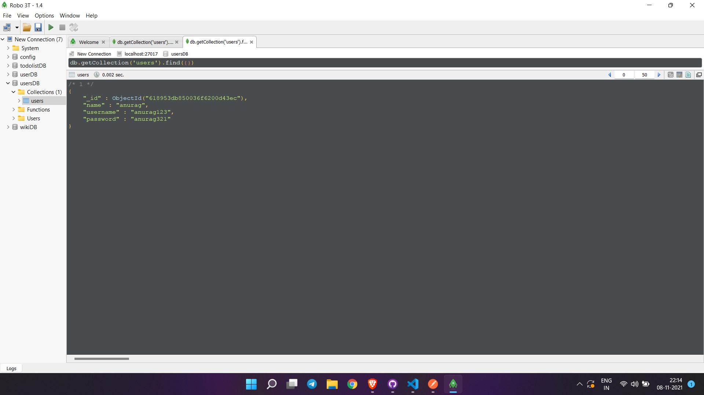
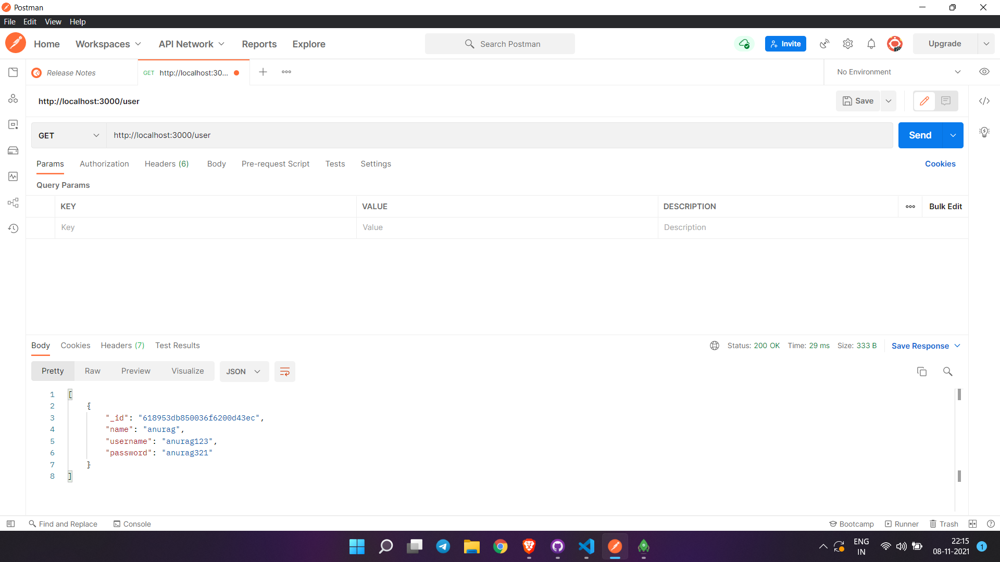
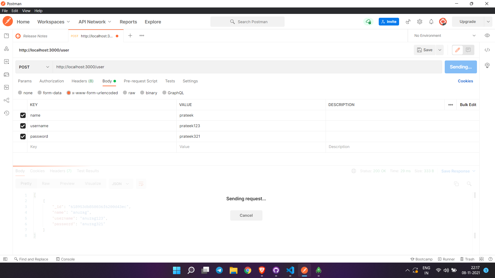
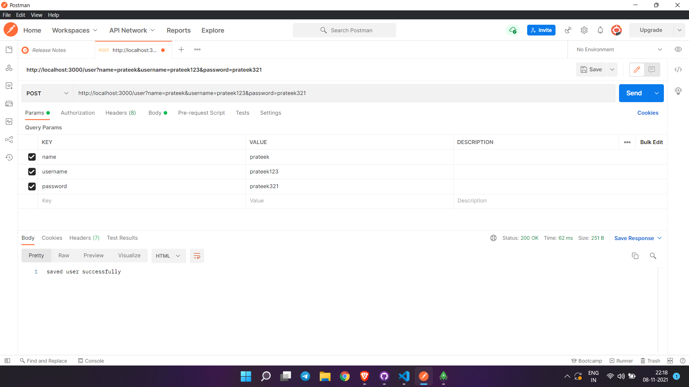
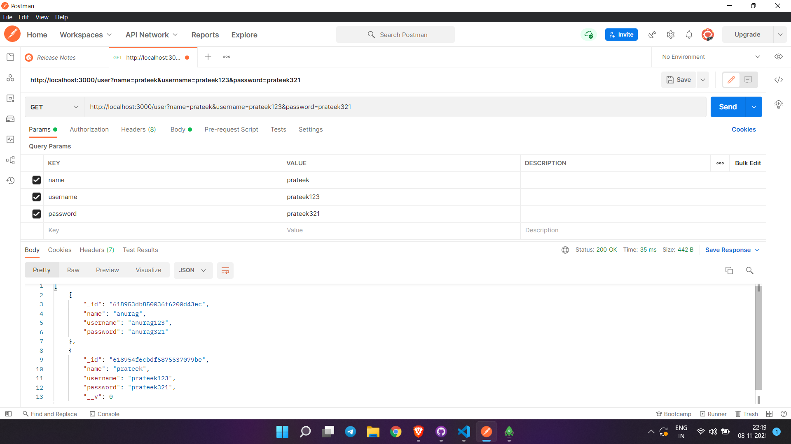
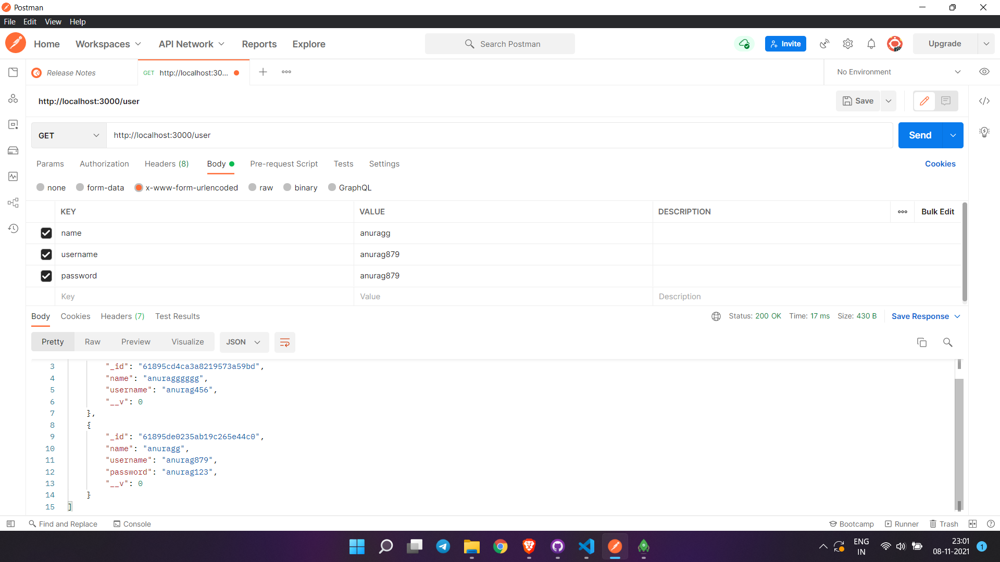

# USER-API

Restful API

1.  First created a user with the details as follows

2. It can be now fetched by get request on postman like this

3. Then added an user with following deatils using post request and reading through get request

4. Then we have an user with name anurag and we are updating its details using patch but after updation we can see that the password reamins the same

